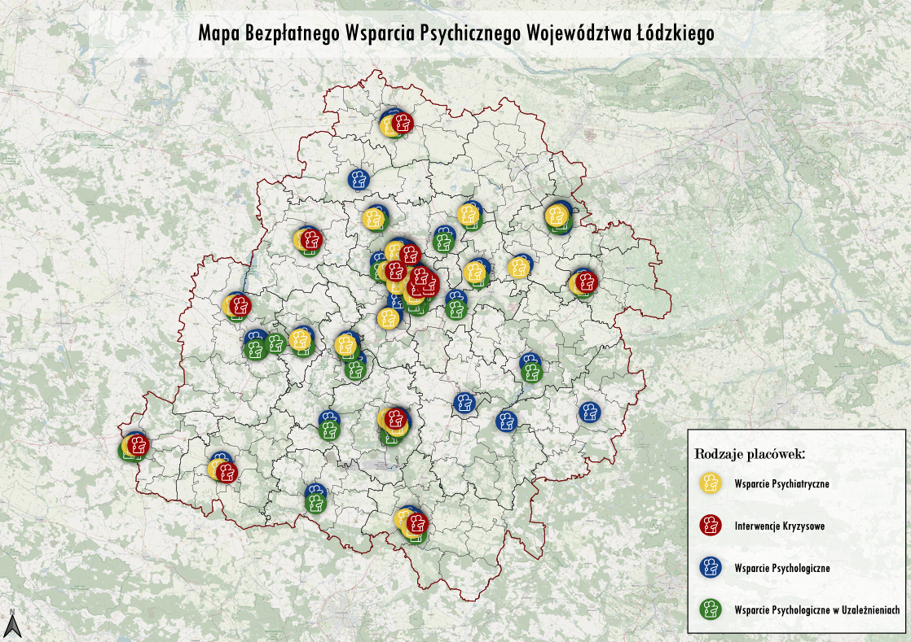
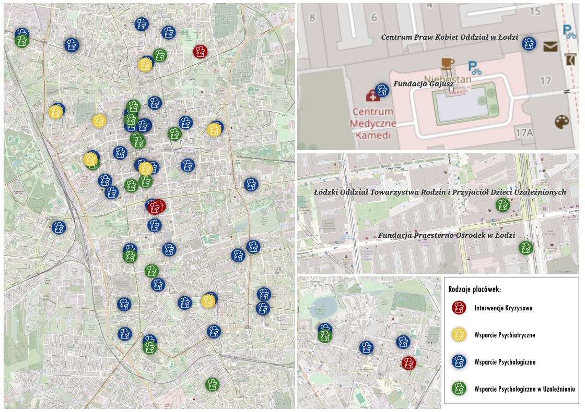
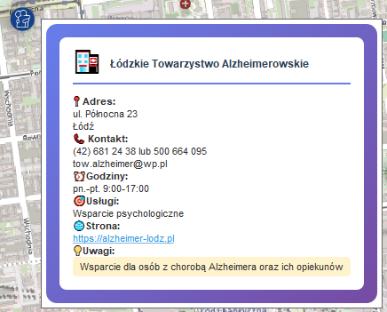

# Map of Free Psychological Support in the Łódź Voivodeship

**[CLICK HERE TO VIEW THE MAP](https://alicjaswiers.github.io/lodzkie-na-mapach-2025/)**

**This project received an honorable mention in the "Łódzkie na mapach 2025" contest organized by the Marshal's Office of the Łódź Voivodeship.**

## About the Project
Access to free psychological help is often hindered by a lack of information. The main goal of my work was to gather this scattered data in one place and present it in a clear, accessible map format. I wanted to ensure that anyone in need could easily and quickly find support in their local area.

This project is proof to me that Geographic Information Systems (GIS) are powerful tools capable of solving real social problems.

### Main Map Composition
A view of the entire Łódź Voivodeship along with a clear, custom legend:

### Details and Map Fragments
For areas with a high density of facilities (e.g., the center of Łódź), I prepared detailed enlargements to maintain readability:

### Clear Information (HTML Pop-ups)
To make the information easier to read, I replaced standard QGIS attribute tables with custom information widgets. Using HTML and CSS directly within the attribute table, I created clear identification windows that immediately display key contact details and opening hours:

## Tools Used
* **QGIS** – data analysis, cartographic composition, and print layouts
* **HTML / CSS** – advanced formatting of attribute pop-up windows